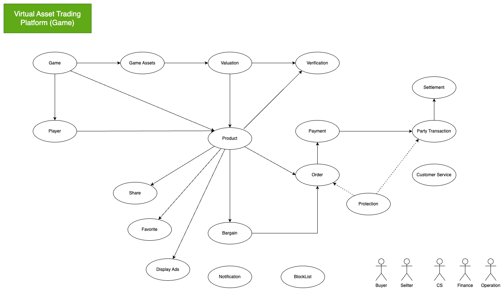

# Virtual asset trading platform

## Project description

This is a virtual asset trading platform. It allows users to buy and sell virtual assets (e.g. Game Accounts).
The platform is built using a microservices architecture, targeting the latest technologies and best practices.
providing a secure, scalable, and reliable platform for trading virtual assets.

## Tech Stack

- [Next.js](https://nextjs.org/) - React framework
- [Spring Boot](https://spring.io/projects/spring-boot) - Java framework
- [JDK 21](https://jdk.java.net/21/) - Java runtime
- [PostgreSQL](https://www.postgresql.org/) - Database
- [Docker](https://www.docker.com/) - Containerization
- [Docker Compose](https://docs.docker.com/compose/) - Container orchestration
- [Jest](https://jestjs.io/) - Testing framework
- [JWT](https://jwt.io/) - JSON Web Token
- [Mockito](https://site.mockito.org/) - Mocking framework
- [Rest Assured](https://rest-assured.io/) - HTTP Testing fraemework
- [Caffeine](https://www.caffeine.com/) - Caching framework
- [Redis](https://redis.io/) - Cache
- [RabbitMQ](https://www.rabbitmq.com/) - Message broker
- [Sentry](https://sentry.io/) - Error tracking
- [SonarCloud](https://sonarcloud.io/) - Code quality
- [GitHub Actions](https://github.com/features/actions) - CI/CD

## Features

- Account
- Virtual Asset
- Ordering
- Payment
- Customer Service
- Instant Messaging Chat
- Notification
- Valuation & Verification
- Settlement
- Platform service
- Admin
- Configuration
- Blacklist

## High-level overview

